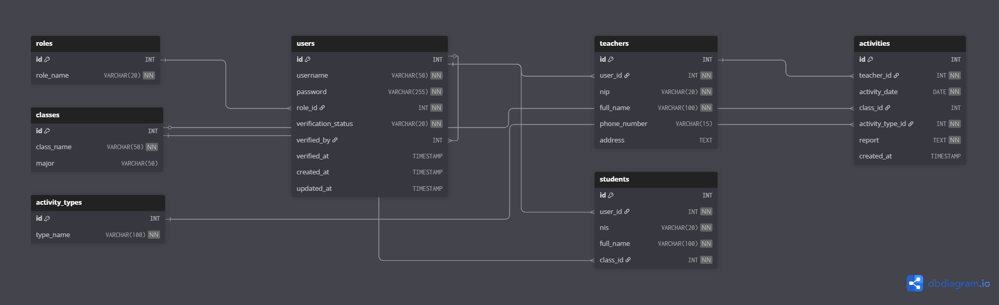

# Proyek Aplikasi Kegiatan Guru

Ini adalah proyek aplikasi web sederhana yang saya bangun untuk latihan dan portofolio. Tujuannya adalah untuk membuat sistem pencatatan kegiatan bagi para guru, yang laporannya bisa diakses juga oleh siswa sebagai agenda.

## Apa yang Aplikasi Ini Lakukan?

Secara singkat, aplikasi ini memiliki dua fungsi utama:
1.  **Untuk Guru**: Menyediakan platform untuk mencatat, melihat riwayat, dan mengelola laporan aktivitas mengajar setiap hari.
2.  **Untuk Siswa**: Memberikan akses untuk melihat agenda atau ringkasan kegiatan dari guru-guru yang relevan dengan kelas mereka.

Akses pengguna dibagi menjadi tiga peran agar sesuai dengan fungsinya:
-   **Admin**: Mengelola data-data utama seperti daftar guru, siswa, kelas, dan akun pengguna.
-   **Guru**: Fokus pada pencatatan aktivitasnya sendiri.
-   **Siswa**: Hanya bisa melihat informasi (read-only) yang relevan untuknya.

## Teknologi yang Digunakan
-   **Backend**: PHP 8+ (Native)
-   **Database**: MySQL
-   **Frontend**: HTML, CSS, JavaScript dengan Bootstrap 5

## Cara Menjalankan Aplikasi
1.  Salin (clone) repositori ini ke komputer Anda.
2.  Letakkan folder proyek di dalam direktori web server Anda (misalnya `htdocs` untuk XAMPP).
3.  Buat sebuah database baru di phpMyAdmin atau sejenisnya.
4.  Impor file `nama_database.sql` (sesuaikan namanya) ke dalam database yang baru Anda buat.
5.  Buka file untuk koneksi database (misalnya `config.php` atau `koneksi.php`) dan sesuaikan nama database, user, serta password dengan pengaturan lokal Anda.
6.  Aplikasi siap diakses melalui browser.

---

## Desain dan Alur
Berikut adalah diagram yang saya buat pada tahap perancangan.

**Struktur Database (ERD)**

**Alur Proses Login**

## Lisensi
Proyek ini menggunakan Lisensi MIT. Hal ini berarti Anda bebas untuk menggunakan, menyalin, memodifikasi, menggabungkan, mempublikasikan, mendistribusikan, dan/atau menjual salinan dari perangkat lunak ini.
