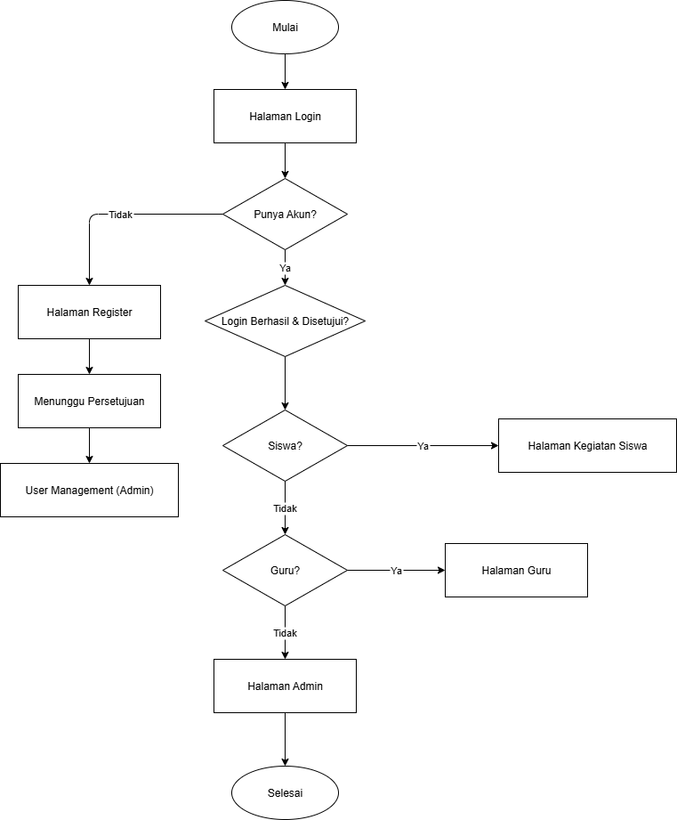

# Aplikasi Peminjaman Fasilitas/Ruangan Sekolah

Aplikasi web ini dibangun untuk mempermudah proses manajemen peminjaman fasilitas dan ruangan di lingkungan sekolah. Tujuannya adalah menciptakan sistem terpusat di mana siswa dan guru dapat mengajukan peminjaman secara online, dan admin dapat mengelolanya dengan efisien.

## Fitur Utama

-   **Pemesanan Online**: Memungkinkan siswa dan guru untuk memesan fasilitas atau ruangan kapan saja dan di mana saja.
-   **Manajemen Peran Pengguna**: Sistem memiliki tiga peran berbeda (Admin, Guru, Siswa) dengan hak akses yang disesuaikan.
-   **Validasi Jadwal Otomatis**: Mencegah pemesanan ganda atau konflik jadwal pada fasilitas yang sama.
-   **Manajemen Fasilitas (CRUD)**: Admin dapat dengan mudah menambah, melihat, mengubah, dan menghapus data fasilitas atau ruangan.
-   **Status Ketersediaan Real-time**: Pengguna dapat melihat apakah sebuah fasilitas tersedia atau sedang dipinjam.
-   **Ekspor Data**: Admin dapat mengekspor laporan peminjaman ke dalam format Excel untuk keperluan dokumentasi.

## Alur Pengguna dan Peran

Akses pengguna dibagi menjadi tiga peran utama untuk memastikan alur kerja yang teratur:

### Admin

-   Login ke sistem.
-   Mengelola data master fasilitas dan ruangan (menambah, mengedit, menghapus).
-   Melihat seluruh daftar permintaan peminjaman yang masuk dari guru dan siswa.
-   Memberikan persetujuan atau menolak permintaan peminjaman.
-   Mengekspor data rekapitulasi peminjaman ke dalam file Excel.

### Guru

-   Login ke sistem menggunakan akunnya.
-   Mengajukan peminjaman fasilitas atau ruangan.
-   Memilih tanggal dan menentukan durasi peminjaman.
-   Melihat status peminjamannya (Diproses, Disetujui, Ditolak).
-   Mengakses riwayat semua peminjaman yang pernah dilakukannya.
-   Dapat mengubah atau membatalkan peminjaman yang telah diajukan.

### Siswa

-   Login ke sistem menggunakan akunnya.
-   Mengajukan peminjaman fasilitas atau ruangan.
-   Memilih tanggal dan menentukan durasi peminjaman.
-   Melihat status peminjamannya (Diproses, Disetujui, Ditolak).
-   Mengakses riwayat semua peminjaman yang pernah dilakukannya.
-   Dapat mengubah atau membatalkan peminjaman yang telah diajukan.

## Teknologi yang Digunakan

-   **Backend**: PHP 8+ (Native)
-   **Database**: MySQL
-   **Frontend**: HTML, CSS, JavaScript
-   **Framework/Library**: Bootstrap 5

## Desain dan Alur
Berikut adalah diagram yang saya buat pada tahap perancangan.

**Struktur Database (ERD)**

**Alur Proses Login**

## Lisensi
Proyek ini menggunakan Lisensi MIT. Hal ini berarti Anda bebas untuk menggunakan, menyalin, memodifikasi, menggabungkan, mempublikasikan, mendistribusikan, dan/atau menjual salinan dari perangkat lunak ini.
