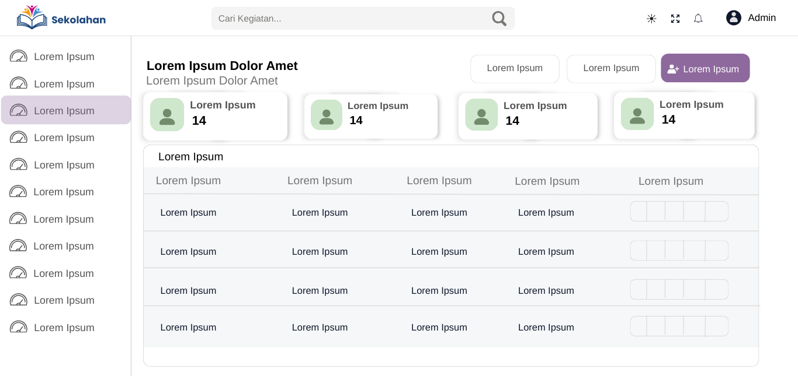

# Aplikasi Kegiatan Guru  

Aplikasi web ini dibangun untuk membantu para guru dalam merencanakan, mengajukan, dan mendokumentasikan kegiatan sekolah secara digital.  
Tujuannya adalah menciptakan sistem yang terpusat dan efisien, di mana guru dapat mengelola kegiatan mereka dan admin dapat memonitor serta memberikan persetujuan dengan mudah.  

---

## Fitur Utama
- **Pengajuan Kegiatan Online**: Guru dapat mengajukan proposal kegiatan kapan saja dan di mana saja tanpa dokumen fisik.  
- **Manajemen Peran Pengguna**: Sistem memiliki dua peran utama: Admin dan Guru dengan hak akses berbeda.  
- **Validasi Jadwal Otomatis**: Mencegah konflik jadwal dengan fasilitas/ruangan yang sudah terpesan.  
- **Manajemen Kegiatan (CRUD)**: Admin dapat menambah, melihat, mengubah, dan menghapus data kegiatan.  
- **Pelacakan Status Real-time**: Guru dapat memantau status pengajuan (Diproses, Disetujui, Ditolak).  
- **Ekspor Data**: Admin dapat mengekspor laporan rekap kegiatan ke format Excel.  

---

## Alur Pengguna dan Peran  

### Admin  
- Login ke dalam sistem.  
- Mengelola data master (guru, fasilitas, ruangan).  
- Melihat seluruh daftar pengajuan kegiatan.  
- Menyetujui atau menolak pengajuan kegiatan.  
- Mengekspor rekap kegiatan ke file Excel.  

### Guru  
- Login menggunakan akun masing-masing.  
- Mengajukan proposal kegiatan (deskripsi, tanggal, kebutuhan fasilitas).  
- Memilih tanggal dan durasi kegiatan.  
- Melihat status pengajuan (Diproses, Disetujui, Ditolak).  
- Mengakses riwayat kegiatan yang pernah diajukan.  
- Mengubah atau membatalkan pengajuan (selama belum disetujui).  

---

## Teknologi yang Digunakan
- **Backend**: PHP 8+ (Native)  
- **Database**: MySQL  
- **Frontend**: HTML, CSS, JavaScript  
- **Framework/Library**: Bootstrap 5  

---

## Desain dan Alur  

### Tampilan Halaman Siswa
  

### Tampilan Halaman Guru
  

### Tampilan Halaman Admin
  

### Struktur Database (ERD)  
  

### Alur Proses Login  
  

---

## Lisensi  
Proyek ini menggunakan **Lisensi MIT**.  
Anda bebas untuk menggunakan, menyalin, memodifikasi, menggabungkan, mempublikasikan, mendistribusikan, dan/atau menjual salinan dari perangkat lunak ini.  
